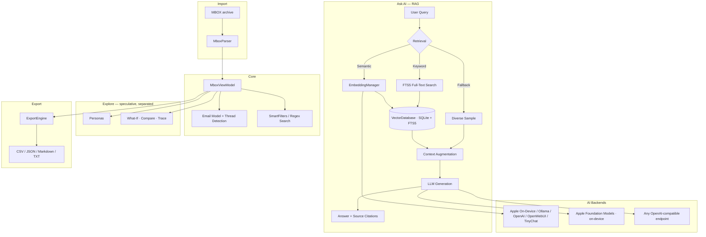

# Ancient History


**A sandboxed, on-device RAG explorer for your email archives.**

Ancient History imports MBOX email archives into a searchable, threaded interface
with a built-in retrieval-augmented generation (RAG) pipeline, so you can ask
natural-language questions about your email history and get answers with **source
citations**. Embedding and generation run **on your Mac by default** (Apple
on-device models); you can also point it at any OpenAI-compatible endpoint.
Nothing leaves your machine unless you choose a remote endpoint.

> **Ancient History is a fork of [MBox Explorer](https://github.com/kochj23/MBox-Explorer)
> by Jordan Koch**, used under the MIT License. The fork is being trimmed and
> reworked toward a focused, sandboxed on-device RAG app — several features from
> the original are not yet wired into this build.

---

## Architecture



---

## Features

### Browse
| Capability | Details |
|---|---|
| Import | MBOX archives (incl. Gmail Takeout / Apple Mail mbox exports) |
| Thread detection | Groups by Message-ID / In-Reply-To / References |
| Search & filter | Full-text search, smart filters (sender, date, attachments), regex search |
| Attachments | Browse, preview, and export attachments; jump to the containing email |
| Merge / Split | Combine MBOX files or split a large archive (RFC 4155-safe `From `-line escaping) |
| PII redaction | Detect and redact personal information before export |
| Analytics & Network | Statistics dashboard and a communication-network graph |

### Ask AI — RAG with citations
| Component | Implementation |
|---|---|
| Vector store | SQLite + FTS5 full-text index + float-array embeddings |
| Retrieval | Three-tier: **semantic** (embeddings) → **keyword** (FTS5) → **diverse sample** |
| Citations | Every answer lists the source emails; click a source to open it |
| Conversation memory | Keeps context across follow-up questions |
| Transparency | A "Last query" badge shows which retrieval path actually answered |

### Explore — speculative (kept separate from cited answers)
Everything in Explore is watermarked **SPECULATIVE** and is never rendered in the
cited-answer view, so speculation can't be mistaken for a sourced fact.
- **Personas** — chat with a simulation of *how a sender wrote*, built from their history.
- **What-If** — explore a hypothesis grounded in relevant emails, with three modes:
  **Explore**, **Compare** (actual vs. alternative), and **Trace** (downstream ripple effects).

### AI backends
| Role | Options |
|---|---|
| Embeddings | **Apple On-Device** (default · NaturalLanguage), Ollama, OpenAI, OpenWebUI, TinyChat |
| Generation | **Apple Foundation Models** (on-device) or any **OpenAI-compatible endpoint** (Bearer-auth supported) |

Switching the embedding model requires re-indexing (the index is stamped with the
embedder's identity so mismatched vector spaces are never compared).

### Export
CSV, JSON, Markdown, and TXT — per-email, per-thread, or AI-optimized chunked text.

---

## Requirements

- **macOS 14 (Sonoma)+**
- **On-device generation** uses Apple Foundation Models and requires **macOS 26+**.
  On earlier macOS, configure an **OpenAI-compatible endpoint** (or Ollama) instead.
- On-device embeddings (Apple NaturalLanguage) work on macOS 14+.
- Apple silicon recommended.

## Build from source

```bash
git clone git@github.com:vibingwithtom/AncientHistory.git
cd AncientHistory
open "MBox Explorer.xcodeproj"   # project/dir still carry the original name
# Build & run: Cmd+R   (scheme: "Ancient History")
```

Run the tests:

```bash
xcodebuild -scheme "Ancient History" -destination "platform=macOS" test
```

---

## Privacy & Security

- **Sandboxed & local-first** — embeddings and generation run on-device by default;
  no data leaves your Mac unless you point it at a remote endpoint.
- **Parameterized SQL** — all database access uses bound parameters.
- **Keychain** — endpoint API keys are stored via the macOS Security framework.
- **No telemetry** — no analytics, tracking, or phone-home behavior.

---

## License

MIT License. Original work © Jordan Koch (*MBox Explorer*); modifications
© *Ancient History* contributors. See [LICENSE](LICENSE) for the full text — the
in-app **About** panel also displays the notice, as the MIT license requires it to
travel with every copy.

## Credits

Forked from [MBox Explorer](https://github.com/kochj23/MBox-Explorer) by Jordan
Koch ([@kochj23](https://github.com/kochj23)).
